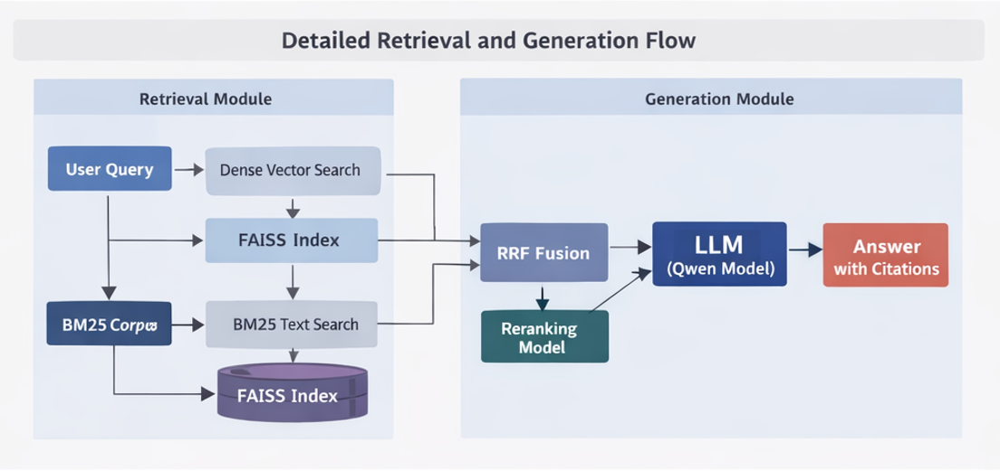
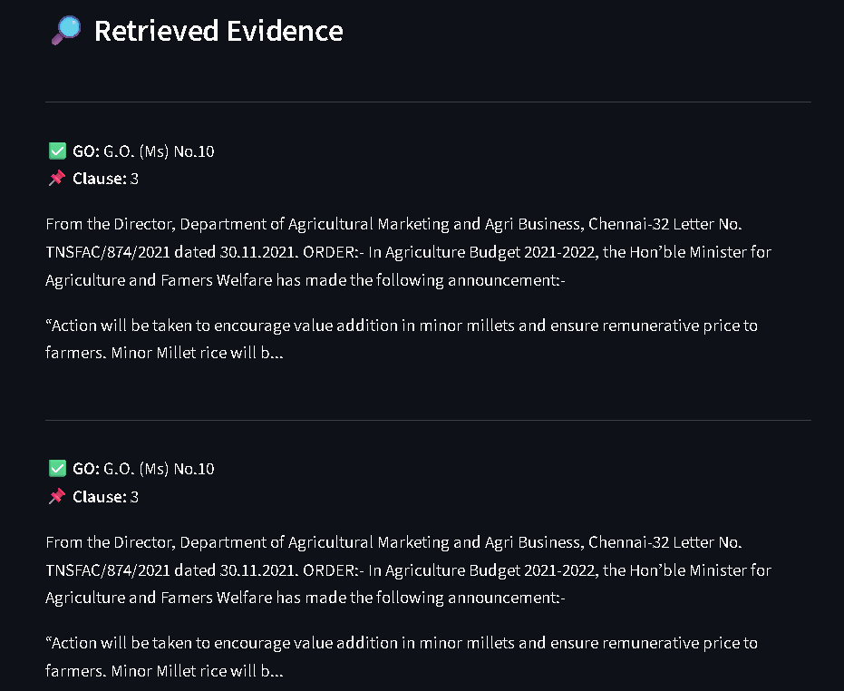
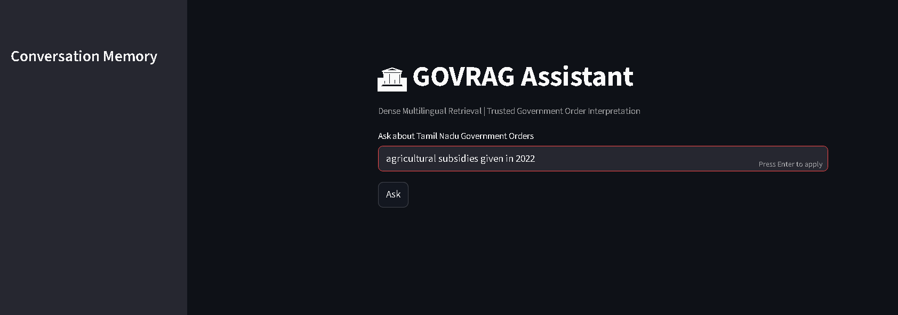
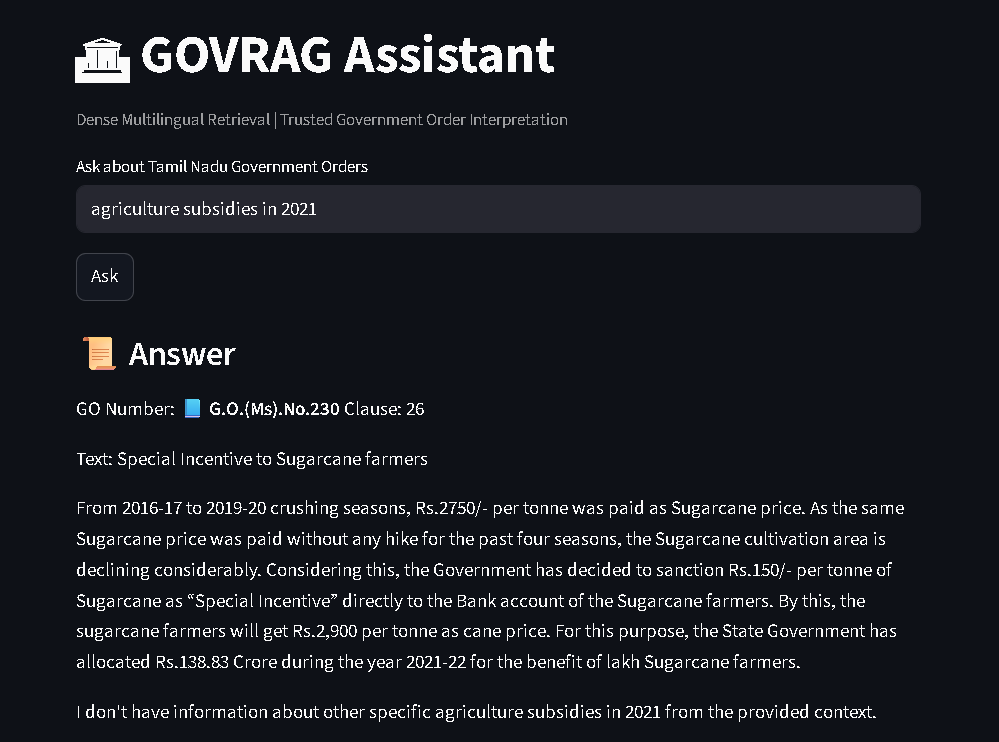

# GOVRAG-TN

### A Domain-Adaptive Cross-Lingual RAG Framework for Trustworthy Interpretation of Tamil Nadu Government Orders

---

## Overview

Government Orders (GOs) form the administrative backbone of policy implementation, financial approvals, amendments, and institutional governance in Tamil Nadu. However, these documents are typically distributed as scanned bilingual PDFs with complex legal structure, making retrieval and interpretation difficult using conventional search systems.

GOVRAG-TN is a domain-adaptive cross-lingual Retrieval-Augmented Generation (RAG) framework designed to provide trustworthy interpretation of Tamil Nadu Government Orders. The framework combines OCR-based document processing, clause-aware chunking, multilingual semantic retrieval, hybrid search, temporal policy prioritization, and citation-grounded generation within a fully offline architecture.

The system supports:
- semantic retrieval across bilingual Government Orders
- clause-level evidence retrieval
- multi-document reasoning
- grounded response generation with citations

---

# Key Features

- OCR-based processing of scanned Government Order PDFs
- Clause-aware legal document chunking
- Cross-lingual semantic embeddings
- Hybrid retrieval using Dense Retrieval + BM25 + RRF
- Multi-GO reasoning and evidence aggregation
- Temporal policy prioritization for recent amendments
- Citation-grounded response generation
- Fully offline deployment using open-source models
- Streamlit-based chatbot interface

---

# System Architecture

Place architecture image inside:

architecture/govrag_architecture.png

Then GitHub will automatically display it below.



---

# Project Structure

```text
GOVRAG-TN
│
├── architecture/
├── dataset/
├── docs/
├── examples/
├── notebooks/
├── outputs/
├── src/
│   ├── config/
│   ├── ingestion/
│   ├── metadata/
│   ├── chunking/
│   ├── embeddings/
│   ├── retrieval/
│   ├── generation/
│   ├── evaluation/
│   └── ui/
│
├── README.md
├── requirements.txt
├── LICENSE
└── .gitignore
```


# Dataset
```
The dataset consists of scanned Tamil Nadu Government Orders collected from the official Tamil Nadu Government portal:

https://www.tn.gov.in/go_view/deptlist.php

The corpus contains:

bilingual administrative documents
scanned PDFs
department-wise Government Orders
amendments and policy notifications

Only representative sample documents are included in this repository.
```

# Methodology
'''
The GOVRAG-TN pipeline consists of the following stages:

OCR-based document extraction
Text cleaning and normalization
Metadata extraction
Clause-aware chunking
Multilingual embedding generation
FAISS vector indexing
Hybrid retrieval and reranking
Multi-GO reasoning
Citation-grounded response generation
Technologies Used
Component	Technology
Programming Language	Python
OCR Engine	Tesseract OCR
Embedding Model	multilingual-e5-large
Vector Search	FAISS
Lexical Retrieval	BM25
Generation Model	Qwen2.5 (7B)
Deployment	Ollama
Interface	Streamlit
Installation
Clone Repository
git clone https://github.com/YOUR_USERNAME/GOVRAG-TN.git
Install Dependencies
pip install -r requirements.txt
Running the System
Start the Chatbot Interface
streamlit run src/ui/chatbot.py
Example Query
What are the agriculture subsidy schemes introduced after 2020?
Example Output

The system:

retrieves relevant Government Orders
identifies supporting clauses
performs grounded generation
provides citation-aware responses
Evaluation Metrics

The framework was evaluated using:

Recall@K
Precision@K
MRR
nDCG
GO Recall
Clause Citation Accuracy
Hallucination Rate
Sample Retrieval Performance
Metric	Score
Recall@5	0.52
Recall@10	0.60
Recall@20	0.64
MRR	0.471
nDCG@10	0.489
'''


# Screenshots
'''
## Chatbot Interface



---

## Sample Query



---

## Generated Response




---


The key contribution of GOVRAG-TN lies in adapting Retrieval-Augmented Generation for governance-oriented document interpretation through:

structure-aware chunking
temporal reasoning
multi-document policy aggregation
citation-grounded response generation
# Research Paper
```

[Access Research Paper]docs/GOVRAG.pdf
```
# Future Scope
```
Potential future extensions include:

graph-based policy reasoning
multilingual expansion
amendment dependency tracking
deployment across broader governance datasets
```